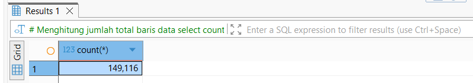

# Coffee-Shop-Sales-Analysis

## Deskripsi Singkat

Proyek ini merupakan analisis penjualan **Coffee Shop** menggunakan **SQL** untuk mengidentifikasi produk unggulan serta adanya pola penjualan berdasarkan waktu. Proyek ini dibuat untuk tujuan pendidikan dan sebagai bagian dari portofolio, serta merupakan **eksplorasi data** yang dilakukan dengan **SQL**. Analisis dilakukan dengan tahapan **Data Understanding**, **Exploratory Data Analysis**, dan terakhir **Business-Oriented Query**.

## Tujuan Analisis

Dalam project ini, difokuskan utnuk menjawab beberapa pertanyaan bisnis utama, antara lain:

- Produk apa yang memiliki jumlah penjualan terbanyak?
- Kategori produk mana yang menghasilkan pendapatan tertinggi?
- Bagaimana tren penjualan berdasarkan: Hari dalam seminggu dan Jam transaksi
- Berapa total dan rata-rata pendapatan harian?
- Apakah terdapat hari tertentu dengan volume transaksi yang lebih tinggi?

## Sturktur Data

Dataset yang digunakan berasal dari pelatihan **Data Analyst** yang di adakan **TutorMy** dan tergabung dalam satu table utama yaitu **Penjualan**.
Struktur data:

- ID_Transaksi : ID unik Transaksi
- Tanggal_Transaksi : Tahun, Bulan, dan Tanggal dari Transaksi
- Waktu_Transaksi : Jam, Menit, dan Detik dari Transaksi
- Jumlah_Transaksi : Jumlah item yang terjual
- ID_Toko : ID unik Toko tempat transaksi terjadi
- Lokasi_Toko : Lokasi atau cabang toko tempat transaksi dilakukan
- ID_Produk : ID unik untuk setiap produk yang dijual
- Harga_Satuan : Harga satuan produk pada saat transaksi
- Kategori_Produk : Kategori umum produk
- Tipe_Produk : Klasifikasi produk yang lebih spesifik dalam satu kategori
- Detail_Produk : Deskripsi detail produk

## Tahapan Analisis

Adapun tahapan analisis dimulai dengan:

1. **Data Understanding**
   - Mengecek jumlah baris data
   - Memahami struktur tabel
   - Memeriksa nilai hilang (NULL)

2. **Exploratory Data Analysis**
   - Analisis distribusi nilai (MIN, MAX)
   - Total dan rata-rata transaksi
   - Agregasi data berdasarkan waktu dan produk

3. **Business-Oriented Query**
   - Fokus pada menjawab pertanyaan yang relevan secara bisnis
   - Menggunakan GROUP BY, ORDER BY, dan HAVING

## Temuan Utama

Pada proses **Data Understanding** dilakukan pemeriksaan awal dengan menghitung jumlah baris data, dimana berdasarkan hasil pemeriksaan diperoleh baris pada data yang digunakan berjumlah 149,116 baris data. 

