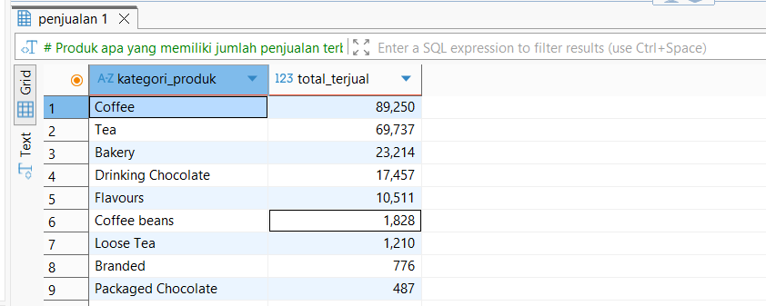
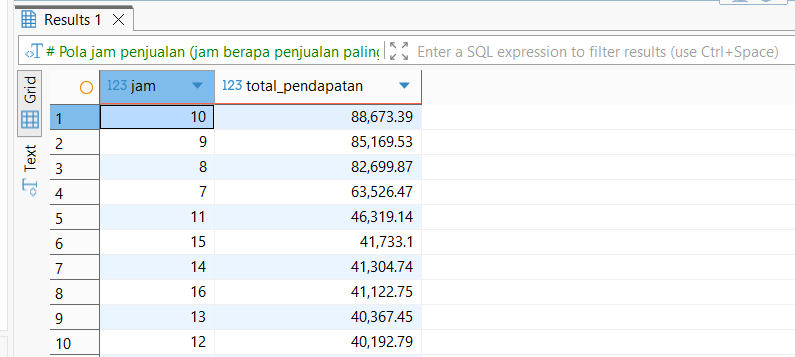
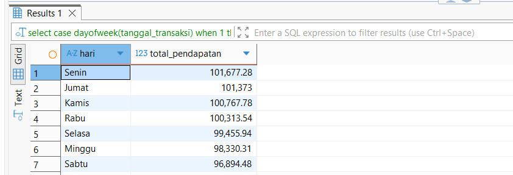

# Coffee-Shop-Sales-Analysis

## Deskripsi Singkat

Proyek ini merupakan analisis penjualan Coffee Shop menggunakan SQL untuk mengidentifikasi produk unggulan serta adanya pola penjualan berdasarkan waktu. Proyek ini dibuat untuk tujuan pendidikan dan sebagai bagian dari portofolio, serta merupakan eksplorasi data yang dilakukan dengan SQL. Analisis dilakukan dengan tahapan Data Understanding, Exploratory Data Analysis, dan terakhir Business-Oriented Query.

## Tujuan Analisis

Dalam project ini, difokuskan utnuk menjawab beberapa pertanyaan bisnis utama, antara lain:

- Produk apa yang memiliki jumlah penjualan terbanyak?
- Kategori produk mana yang menghasilkan pendapatan tertinggi?
- Bagaimana tren penjualan berdasarkan: Hari dalam seminggu dan Jam transaksi
- Berapa total dan rata-rata pendapatan harian?
- Apakah terdapat hari tertentu dengan volume transaksi yang lebih tinggi?

## Sturktur Data

Dataset yang digunakan berasal dari pelatihan Data Analyst yang di adakan TutorMy dan tergabung dalam satu table utama yaitu Penjualan.
Struktur data:

- ID_Transaksi : ID unik Transaksi
- Tanggal_Transaksi : Tahun, Bulan, dan Tanggal dari Transaksi
- Waktu_Transaksi : Jam, Menit, dan Detik dari Transaksi
- Jumlah_Transaksi : Jumlah item yang terjual
- ID_Toko : ID unik Toko tempat transaksi terjadi
- Lokasi_Toko : Lokasi atau cabang toko tempat transaksi dilakukan
- ID_Produk : ID unik untuk setiap produk yang dijual
- Harga_Satuan : Harga satuan produk pada saat transaksi
- Kategori_Produk : Kategori umum produk
- Tipe_Produk : Klasifikasi produk yang lebih spesifik dalam satu kategori
- Detail_Produk : Deskripsi detail produk

## Tahapan Analisis

Adapun tahapan analisis dimulai dengan:

1. **Data Understanding**
   - Mengecek jumlah baris data
   - Memahami struktur tabel
   - Memeriksa nilai hilang (NULL)

2. **Exploratory Data Analysis**
   - Analisis distribusi nilai (MIN, MAX)
   - Total dan rata-rata transaksi
   - Agregasi data berdasarkan waktu dan produk

3. **Business-Oriented Query**
   - Fokus pada menjawab pertanyaan yang relevan secara bisnis
   - Menggunakan GROUP BY, ORDER BY, dan HAVING

## Temuan Utama

Secara umum, penjualan didominasi oleh produk Tea dan Coffee. Coffee menjadi produk yang paling sering terjual dengan total 89.250 unit, disusul Tea sebanyak 69.737 unit, sementara produk lainnya menunjukkan volume penjualan yang relatif jauh lebih rendah.

Dari sisi nilai penjualan, Coffee juga memberikan kontribusi terbesar dengan total pendapatan 269.952,45, diikuti oleh Tea sebesar 196.405,95, menegaskan peran kedua produk ini sebagai penggerak utama penjualan.

Dari pola waktu, aktivitas penjualan cenderung meningkat pada pagi hari, khususnya mulai jam 8 hingga mencapai puncaknya pada jam 10, dengan total pendapatan tertinggi sebesar 88.673,39.

Sementara itu, berdasarkan tren penjualan harian dalam satu minggu, secara keseluruhan transaksi paling tinggi terjadi pada hari Senin dan Jumat. Hari Senin mencatat pendapatan tertinggi sebesar 101.677,28, disusul Jumat dengan 101.373,00, yang menunjukkan bahwa penjualan cenderung lebih ramai di awal dan menjelang akhir minggu.

## Kesimpulan 

Pola penjualan menunjukkan bahwa aktivitas pelanggan meningkat pada jam-jam tertentu, khususnya pada pagi hari antara pukul 8 hingga 10, yang kemungkinan dipengaruhi oleh jam operasional dan kebiasaan konsumsi pelanggan sebelum memulai aktivitas. Selain itu, terdapat perbedaan tingkat transaksi antar hari, di mana hari Senin dan Jumat mencatat penjualan lebih tinggi, yang diduga berkaitan dengan awal aktivitas kerja di awal minggu serta meningkatnya mobilitas menjelang akhir minggu. Dari sisi produk, penjualan tidak tersebar secara merata karena Tea dan Coffee menjadi produk unggulan yang lebih diminati pelanggan, sehingga mendominasi baik dari segi volume maupun pendapatan.

## Rekomendasi Bisnis 

Berdasarkan hasil analisis, Coffee Shop disarankan untuk memaksimalkan stok dan kesiapan operasional pada hari serta jam dengan volume transaksi tertinggi agar potensi penjualan tidak terlewat. Selain itu, produk dengan performa penjualan rendah perlu dievaluasi lebih lanjut, baik melalui strategi promosi, penyesuaian harga, maupun pengurangan varian produk agar penawaran lebih efektif dan efisien.

